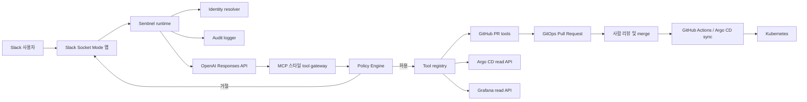
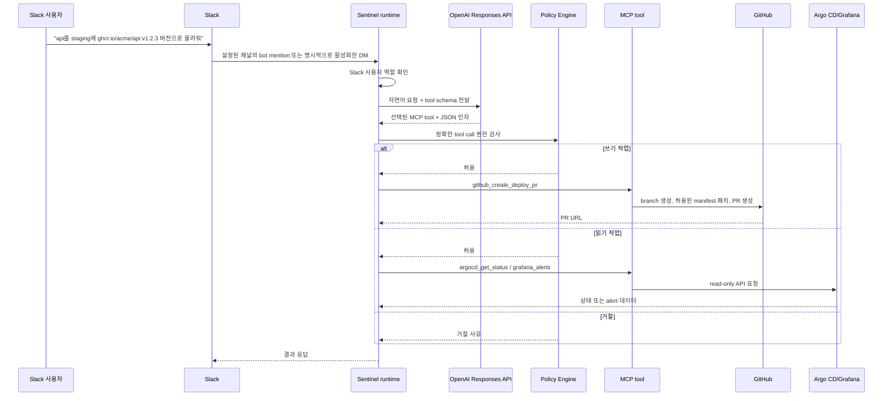

# Sentinel

Sentinel은 Slack에서 자연어로 운영 요청을 받는 AI GitOps DevOps Agent입니다.

사용자는 `/deploy` 같은 명령어를 외울 필요가 없습니다. Sentinel에게 DM을 보내거나 채널에서 멘션하면, LLM이 의도를 해석하고 허용된 MCP 스타일 도구를 선택합니다. 쓰기 작업은 Kubernetes를 직접 변경하지 않고 GitHub Pull Request만 생성합니다.

```text
Slack 자연어 -> OpenAI Responses API -> MCP tool 선택 -> Policy Engine -> GitHub PR / Argo CD / Grafana
```

## 구조



## 요청 흐름



## 현재 가능한 기능

- Slack Socket Mode 봇 실행
- Slack bot mention 자연어 처리(DM은 기본 비활성화)
- OpenAI Responses API tool calling
- in-process MCP 스타일 tool gateway
- 모든 tool call 전 Policy Engine 검사
- deploy/restart/rollback/access 소스 오브 트루스 변경 PR 생성
- deploy/rollback PR에서 허용된 digest 고정 Deployment image 한 개만 변경
- restart PR에서 Deployment Pod template의 `sentinel.dev/restartedAt` 변경
- Argo CD 앱 목록, OutOfSync, 상태, managed resource, Pod, 제한된 Pod 로그 조회
- Grafana API로 alert 조회
- JSON audit 로그 출력
- 지정 Slack 채널로 모니터링/알람 메시지 발송

## Slack 사용 예시

Sentinel에게 DM을 보내거나 채널에서 멘션하면 됩니다. Slack 인터페이스는 자연어만 사용합니다.

| 목적 | Slack 메시지 예시 | MCP tool |
| --- | --- | --- |
| 배포 | `api를 staging에 ghcr.io/acme/api:v1.2.3 버전으로 올려줘` | `github_create_deploy_pr` |
| 배포 | `Deploy api to staging with ghcr.io/acme/api:v1.2.3` | `github_create_deploy_pr` |
| 재시작 | `api staging 재시작해줘` | `github_create_restart_pr` |
| 롤백 | `api production을 v1.2.2로 롤백해줘` | `github_create_rollback_pr` |
| Argo CD 상태 | `api production 상태 확인해줘` | `argocd_get_status` |
| Argo CD 리소스 | `commerce managed resources 보여줘` | `argocd_diff` |
| OutOfSync 앱 | `OutOfSync 애플리케이션 보여줘` | `argocd_list_out_of_sync` |
| Argo CD Pod | `commerce pod 보여줘` | `argocd_list_pods` |
| Argo CD 로그 | `commerce 최근 로그 보여줘` | `argocd_get_logs` |
| Grafana alert | `api 관련 Grafana alert 보여줘` | `grafana_alerts` |
| 온보딩 | `alice@example.com 온보딩 PR 만들어줘` | `github_create_onboard_pr` |
| 권한 부여 | `alice@example.com에게 operator 권한 부여 PR 만들어줘` | `github_create_grant_pr` |
| 권한 회수 | `alice@example.com operator 권한 회수 PR 만들어줘` | `github_create_revoke_pr` |
| 오프보딩 | `alice@example.com 오프보딩 PR 만들어줘` | `github_create_offboard_pr` |


## Access 자동화 범위

Access tool은 `access/users.yaml`과 `external/tailscale/policy.hujson`의 관리 대상 역할 그룹을 함께 수정하는 리뷰 가능한 PR을 만듭니다. `cluster-config`의 workflow는 `access/roles.yaml` 기준 렌더링 결과가 커밋된 정책과 같은지 먼저 검증한 뒤 Tailscale에 publish합니다. Sentinel이 관리하지 않는 그룹과 나머지 정책 필드는 보존합니다.
## 안전 원칙

Sentinel은 다음 기능을 제공하지 않습니다.

- `kubectl apply`
- `kubectl delete`
- `terraform apply`
- SSH
- 임의 shell 실행
- secret 조회
- Kubernetes 직접 변경

쓰기 가능한 도구는 GitHub Pull Request만 생성합니다.

## 실행

```bash
python -m pip install -e ".[dev]"
python -m sentinel
```

필수 환경변수:

```bash
SENTINEL_OPENAI_API_KEY=...
SENTINEL_SLACK_BOT_TOKEN=xoxb-...
SENTINEL_SLACK_APP_TOKEN=xapp-...
SENTINEL_SLACK_SIGNING_SECRET=...
SENTINEL_SLACK_CONTROL_CHANNELS=C_COMMAND_CHANNEL_ID
SENTINEL_GITHUB_TOKEN=...
SENTINEL_GITOPS_REPO=owner/cluster-config
SENTINEL_OPERATOR_SLACK_USER_IDS='["U_ADMIN_SLACK_ID"]'
SENTINEL_ADMIN_SLACK_USER_IDS='["U_ADMIN_SLACK_ID"]'
SENTINEL_SLACK_ALERT_CHANNEL_ID=C_ALERT_CHANNEL_ID
```

선택 연동:

```bash
SENTINEL_ARGOCD_BASE_URL=https://argocd.example.internal
SENTINEL_ARGOCD_TOKEN=...
SENTINEL_GRAFANA_BASE_URL=https://grafana.example.internal
SENTINEL_GRAFANA_TOKEN=...
```

기본값은 dry-run PR입니다. 실제 PR을 만들려면:

```bash
SENTINEL_GITHUB_PR_DRY_RUN=false
```


## Slack 채널 분리

Sentinel은 두 Slack 채널을 분리해서 사용합니다.

- `SENTINEL_SLACK_CONTROL_CHANNELS=C_COMMAND_CHANNEL_ID`: 이 비공개 채널에서 `@센티널`로 부르면 자연어 명령을 수행합니다.
- `SENTINEL_SLACK_ALERT_CHANNEL_ID=C_ALERT_CHANNEL_ID`: 모니터링 경고, 알람, 오류 메시지를 Sentinel 봇 이름으로 전송합니다.

두 채널 모두 비공개 채널이면 Sentinel 봇을 각각 초대해야 합니다. 알림은 Slack Bot Token의 `chat.postMessage`로 보내므로 Slack에는 앱의 봇 이름으로 표시됩니다.

알림 발송 테스트:

```bash
sentinel-slack-notify --severity warning --title "Sentinel test" --body "Slack alert channel is connected."
```
## 왜 tool 구현이 필요한가?

LLM은 판단과 tool 선택을 담당합니다. 하지만 GitHub PR 생성, Argo CD 조회, Grafana 조회 같은 실제 동작은 안전하게 구현된 tool 코드가 수행해야 합니다. 그래야 권한 검사, 감사 로그, 오류 처리, secret 차단, GitOps PR 생성 규칙을 강제할 수 있습니다.


