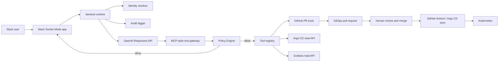
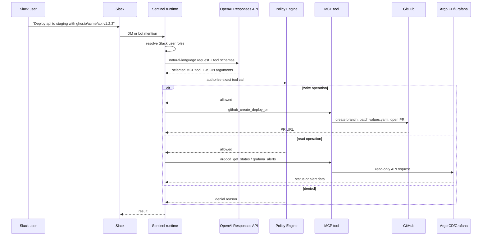

# Sentinel

Sentinel is an AI GitOps DevOps Agent for Slack.

Users do not need to memorize slash commands. They can DM or mention Sentinel in natural language, and the LLM selects approved MCP-style tools. Write operations never mutate Kubernetes directly; they create GitHub pull requests that humans review and merge.

```text
Slack natural language -> OpenAI Responses API -> MCP tool selection -> Policy Engine -> GitHub PR / Argo CD / Grafana
```

## Architecture



## Request Flow



## What Works Now

- Slack Socket Mode bot
- Slack DM and bot mention handling
- OpenAI Responses API tool calling
- In-process MCP-style tool gateway
- Policy checks before every tool call
- GitHub PR creation for deploy, restart, rollback, and access source-of-truth changes
- Deploy and rollback PRs patch Helm values files by updating `image.repository` and `image.tag`
- Restart PRs patch `podAnnotations.sentinel.dev/restartedAt`
- Argo CD API status and managed-resource reads
- Grafana API alert reads
- JSON audit logs
- Monitoring and alert messages to a configured Slack channel

## Slack Usage Examples

You can DM Sentinel or mention it in a channel. Natural language is the only Slack interface.

| Goal | Example Slack message | MCP tool |
| --- | --- | --- |
| Deploy | `api를 staging에 ghcr.io/acme/api:v1.2.3 버전으로 올려줘` | `github_create_deploy_pr` |
| Deploy | `Deploy api to staging with ghcr.io/acme/api:v1.2.3` | `github_create_deploy_pr` |
| Restart | `api staging 재시작해줘` | `github_create_restart_pr` |
| Rollback | `Rollback api in production to v1.2.2` | `github_create_rollback_pr` |
| Argo CD status | `api production 상태 확인해줘` | `argocd_get_status` |
| Argo CD resources | `Show managed resources for api staging` | `argocd_diff` |
| Grafana alerts | `api 관련 Grafana alert 보여줘` | `grafana_alerts` |
| Onboard | `alice@example.com 온보딩 PR 만들어줘` | `github_create_onboard_pr` |
| Grant access | `alice@example.com에게 operator 권한 부여 PR 만들어줘` | `github_create_grant_pr` |
| Revoke access | `alice@example.com operator 권한 회수 PR 만들어줘` | `github_create_revoke_pr` |
| Offboard | `alice@example.com 오프보딩 PR 만들어줘` | `github_create_offboard_pr` |


## Access Automation Scope

Onboarding, offboarding, grant, and revoke tools create reviewable PRs that patch `access/users.yaml`, the access source of truth. After those changes are merged, the `access-sync` GitHub Actions workflow runs `sentinel-access-sync` to apply the approved state:

- sync GitHub team memberships through the GitHub API, including removals when `--sync-removals` is enabled
- sync Grafana team memberships through the Grafana API, including removals when `--sync-removals` is enabled
- render Tailscale ACL policy JSON and publish it through the Tailscale API when credentials are configured
- generate Argo CD RBAC policy CSV for GitOps-managed Argo CD configuration

This keeps the same safety model: the LLM creates PRs, humans approve, and automation applies the merged source-of-truth state after merge.

## Safety Rules

Sentinel does not expose tools for:

- `kubectl apply`
- `kubectl delete`
- `terraform apply`
- SSH
- arbitrary shell execution
- secret reads
- direct Kubernetes mutation

Write-capable tools create GitHub pull requests only.

## Quickstart

Install locally:

```bash
python -m pip install -e ".[dev]"
```

Required environment variables:

```bash
SENTINEL_OPENAI_API_KEY=...
SENTINEL_SLACK_BOT_TOKEN=xoxb-...
SENTINEL_SLACK_APP_TOKEN=xapp-...
SENTINEL_SLACK_SIGNING_SECRET=...
SENTINEL_SLACK_CONTROL_CHANNELS=C_COMMAND_CHANNEL_ID
SENTINEL_GITHUB_TOKEN=...
SENTINEL_GITOPS_REPO=owner/cluster-config
SENTINEL_OPERATOR_SLACK_USER_IDS='["U_ADMIN_SLACK_ID"]'
SENTINEL_ADMIN_SLACK_USER_IDS='["U_ADMIN_SLACK_ID"]'
SENTINEL_SLACK_ALERT_CHANNEL_ID=C_ALERT_CHANNEL_ID
```

Optional API integrations:

```bash
SENTINEL_ARGOCD_BASE_URL=https://argocd.example.internal
SENTINEL_ARGOCD_TOKEN=...
SENTINEL_GRAFANA_BASE_URL=https://grafana.example.internal
SENTINEL_GRAFANA_TOKEN=...
```

Run:

```bash
python -m sentinel
```

Dry-run PR mode is enabled by default. To create real PRs:

```bash
SENTINEL_GITHUB_PR_DRY_RUN=false
```


## Slack Channel Split

Sentinel uses two Slack channels for separate jobs.

- `SENTINEL_SLACK_CONTROL_CHANNELS=C_COMMAND_CHANNEL_ID`: mention Sentinel in this private channel to run natural-language commands.
- `SENTINEL_SLACK_ALERT_CHANNEL_ID=C_ALERT_CHANNEL_ID`: send monitoring warnings, alerts, and errors as the Sentinel bot.

Invite the Sentinel bot to both private channels. Alert delivery uses Slack `chat.postMessage` with the bot token, so messages appear under the Slack app's bot name.

Test notification delivery:

```bash
sentinel-slack-notify --severity warning --title "Sentinel test" --body "Slack alert channel is connected."
```
## GitOps Path Convention

By default deploy/restart/rollback tools patch:

```text
apps/{service}/overlays/{environment}/values.yaml
```

Override it with:

```bash
SENTINEL_GITOPS_DEPLOY_VALUES_PATH_TEMPLATE=apps/{service}/envs/{environment}/values.yaml
```

## Documentation

- [Korean README](README.ko.md)
- [English Docs](docs/en/README.md)
- [Korean Docs](docs/ko/README.md)
- [System Architecture](docs/architecture/SYSTEM_ARCHITECTURE.md)
- [Technical Specification](docs/specs/TECHNICAL_SPECIFICATION.md)
- [API Specification](docs/specs/API.md)
- [Tool Specification](docs/specs/TOOLS.md)
- [Slack Specification](docs/specs/SLACK.md)
- [GitHub Actions Specification](docs/specs/GITHUB_ACTIONS.md)
- [GitOps and Kubernetes Specification](docs/specs/GITOPS_KUBERNETES.md)
- [Access Model](docs/specs/ACCESS.md)
- [Audit Specification](docs/specs/AUDIT.md)
- [Security Design](docs/specs/SECURITY.md)
- [Implementation Plan](docs/IMPLEMENTATION_PLAN.md)

## License

Apache License 2.0.


